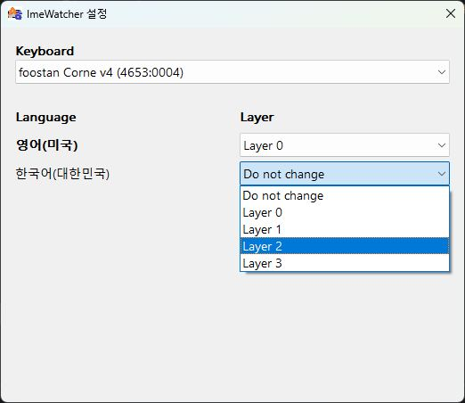

# ImeWatcher


윈도우 IME의 언어 변경을 감지하고 qmk 키보드의 레이어 변경을 지원합니다.

# 할 수 있는 것
- 날개셋 입력기 사용 불가능한 윈도우 환경(vdi 원격 등)에서 윈도우 내장 두벌식(혹은 내장 세벌식) 레이아웃을 가정한 커스텀 자판을 쓰고 싶은 경우  
- IME 언어 상태에 따라 다른 레이어를 사용하기

---

# 사용 전 설정
## QMK 펌웨어 연동 (IME → 레이어 스위치)

레이어 변환을 위해선 펌웨어에 기능 추가가 필요합니다.

### 제공 파일

아래 두 파일을 **자신의 keymap 폴더**로 복사하세요.

- `firmware/qmk/imewatcher_rawhid.c`
- `firmware/qmk/imewatcher_rawhid.h`

예시 경로:

`qmk_firmware/keyboards/<keyboard>/keymaps/<keymap>/`

### 기능 활성화

keymap의 `rules.mk`에 `SRC += imewatcher_rawhid.c` 한줄 추가하세요.

```make
VIA_ENABLE = yes
RAW_ENABLE = yes

SRC += imewatcher_rawhid.c
```

> - 이미 keymap이 `via_command_kb()` 또는 `raw_hid_receive_kb()`를 구현하고 있다면 심볼 충돌을 피하기 위해 로직을 병합해야 합니다. 
> - `imewatcher_rawhid.c`의 `imewatcher_handle_rawhid_packet(...)`를 기존 핸들러에서 호출하는 형태로 합칠 수 있습니다.

### 빌드 / 플래시 (qmk_firmware)

```sh
qmk compile -kb <keyboard> -km <keymap>
qmk flash   -kb <keyboard> -km <keymap>
```

### Vial 빌드 (vial-qmk)

Vial은 훅이 `raw_hid_receive_kb`로 다르지만, 동일 모듈로 지원합니다.
`vial-qmk` 트리로 빌드하면서 아래 설정을 사용하세요.

```make
VIAL_ENABLE = yes
RAW_ENABLE  = yes

SRC += imewatcher_rawhid.c
```

### 프로토콜

ImeWatcher는 레이어 변경을 위해 32바이트 Raw HID 패킷을 보냅니다.

- `data[0] = 0x21`
- `data[1..4] = "IMEW"`
- `data[5] = 0x01` (default layer set)
- `data[6] = layer_index`
- `data[7]`는 응답 status로 사용

펌웨어 동작:

- `default_layer_set(1 << layer_index)` (비영속 전환; EEPROM write 없음)

# License
ImeWatcher is licensed under the GNU General Public License v3.0 only (GPL-3.0-only). See `LICENSE`.

This project uses `qmk-via-api` (GPL-3.0-only), which is based in parts on `the-via/app` (GPL-3.0).
